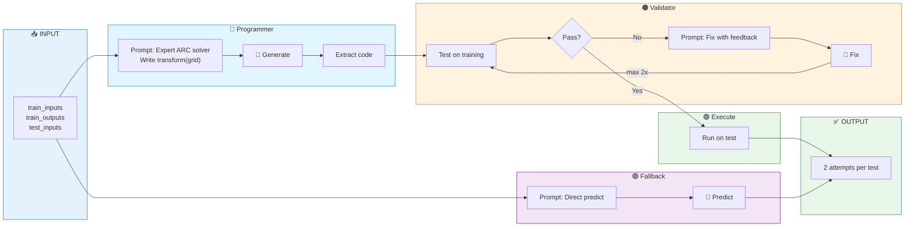

# GEPA-Evolved ARC-AGI Agent Architecture

**89.5% accuracy** (vs 32.5% seed) | **$0.14/task** with Gemini 3 Flash



---

## Prompt Summaries

| Stage | Prompt | Key Elements |
|-------|--------|--------------|
| **Programmer** | Generate `transform(grid)` | Role: "expert ARC solver", hints (objects, symmetry, colors), numpy template |
| **Fixer** | Fix failed code | Previous code + "expected X, got Y" feedback, re-show examples |
| **Fallback** | Direct prediction | No code, JSON output format, backup for code failures |

---

## Why This Architecture Works

| Component | Seed Agent | Evolved Agent | Impact |
|-----------|------------|---------------|--------|
| **Approach** | Direct prediction | Code synthesis | +40% accuracy |
| **Validation** | None | Test on ALL training | Catches bugs |
| **Error handling** | None | Feedback loop (2x) | Fixes edge cases |
| **Attempts** | 1 per test | 2 per test | Uses full quota |
| **Fallback** | None | Direct LLM backup | Never returns empty |

## LLM Call Pattern

```
solve() called
│
├─► LLM Call 1: Programmer (generate transform code)
│
├─► [If validation fails]
│   └─► LLM Call 2: Fixer (fix code with error feedback)
│       └─► [If still fails]
│           └─► LLM Call 3: Fixer (second attempt)
│
└─► LLM Call 4: Fallback (direct prediction for 2nd attempt)

Total: 2-4 LLM calls per problem
```

## Key Insight: Test-Driven Development for LLMs

GEPA discovered that **validating code against training examples before submission** is crucial. This is essentially **test-driven development** applied to LLM code generation:

1. Generate code
2. Run tests (training examples)
3. If tests fail, show errors to LLM
4. LLM fixes code
5. Repeat until tests pass or max retries

This pattern could generalize to other code generation tasks beyond ARC-AGI.
