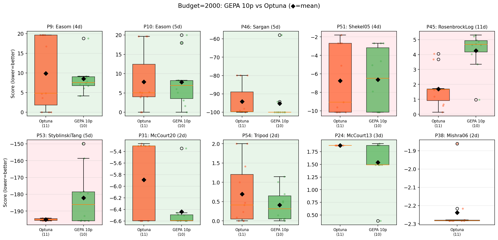

# Blackbox Mathematical Optimization (Appendix B)

**Paper claim.** Single-task search over solver code on the 56-problem EvalSet benchmark. With a budget of **8,000 evaluations/problem**, `optimize_anything` ties Optuna on 40 problems, wins 7, loses 9. On the **10 selected hardest problems** at a tighter **2,000-evaluation budget**, `optimize_anything` wins **7 / 10**.

The evolved solvers tailor themselves to each landscape — discovering L-BFGS-B for boundary optima and multi-start search for deceptive traps — rather than running a fixed TPE → CMA-ES pipeline.

## What's bundled

This folder reproduces the **10-hardest-problems @ 2,000 evals** result. Problem indices: `[9, 10, 24, 31, 38, 45, 46, 51, 53, 54]`.

## Code (this folder)

| File | Purpose |
|---|---|
| `main.py` | Entrypoint. Single-problem `optimize_anything` run with externally-tracked evaluation budget |
| `config.py` | CLI argument parser (`--problem-index`, `--evaluation-budget`, `--num-proposals`, `--llm-model`, ...) |
| `utils.py` | `BudgetTracker` (counts actual objective calls even when generated code crashes), `execute_code`, `extract_best_xs`, seed code, `OBJECTIVE`, `BACKGROUND` |
| `problems.py` | Problem registry — selects from the 56-problem EvalSet by index |
| `evalset.py` | The full EvalSet benchmark (56 problems) |

## Reproduction

```bash
export OPENROUTER_API_KEY=<your-key>     # paper used GPT-5.1

uv run python main.py \
    --problem-index 9 \
    --evaluation-budget 2000 \
    --num-proposals 10 \
    --llm-model openai/gpt-5.1
```

To re-run all 10 hardest problems sequentially:

```bash
for p in 9 10 24 31 38 45 46 51 53 54; do
    uv run python main.py --problem-index $p --evaluation-budget 2000 --num-proposals 10
done
```

Each run writes to `outputs/<run-name>/problem_<i>/<model>/<seed>/<timestamp>/` with `gepa_state.bin`, `eval_log.jsonl`, and `results.json`.

## Result



`optimize_anything` wins **7 / 10** of the hardest problems against Optuna at the 2,000-evaluation budget.

## `logs/`

Bundled paper-run output for the 10 hardest problems:

```
logs/
├── b2000_gepa10p_vs_optuna_hardest.png      # paper figure
├── optimize_anything_b2000/problem_<i>/gpt-5.1/<seed>/<timestamp>/
│   ├── gepa_state.bin     # full GEPA optimizer checkpoint
│   ├── eval_log.jsonl     # per-call objective trace
│   └── results.json
└── optuna_b2000/problem_<i>/
    ├── seed_<0..9>/                   # 10 seeds per problem
    └── <timestamp>.json               # aggregated results
```

Restore any `gepa_state.bin` with `gepa.GEPAState.load()` to inspect the candidate pool, Pareto frontier, and per-iteration solver code.
